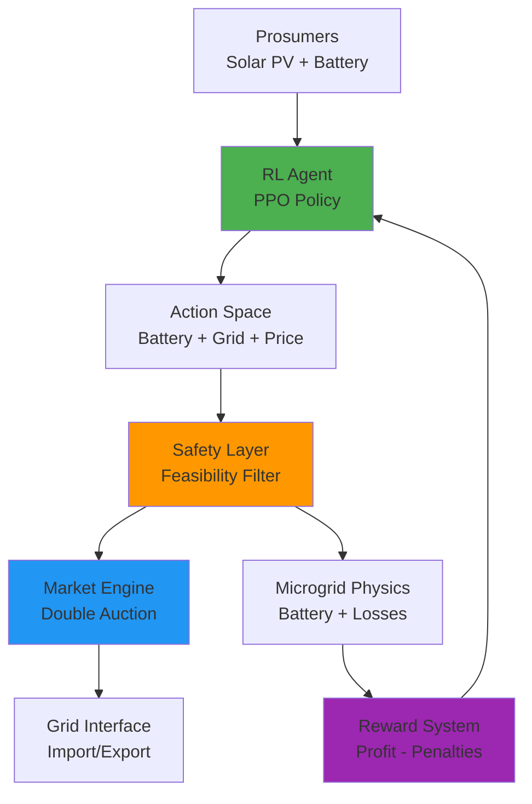

# P2P-RL-Model: Autonomous Peer-to-Peer Energy Trading using Multi-Agent Reinforcement Learning

[](https://www.python.org/)
[](LICENSE)
[](https://stable-baselines3.readthedocs.io/)

A research-grade **Multi-Agent Reinforcement Learning (MARL)** framework for **Peer-to-Peer (P2P) Energy Trading** in microgrids. This system transforms prosumers (households with Solar PV + Battery) into grid-aware intelligent agents that optimize energy management through autonomous trading.

---

## 🎯 Project Overview

This project implements an autonomous P2P energy trading system where multiple prosumers with solar panels and battery storage can:

- **Maximize Economic Profit** through P2P trading instead of grid export
- **Minimize Grid Dependence** via self-consumption and local energy sharing
- **Respect Physical Constraints** including battery health and grid limits
- **Reduce Carbon Footprint** by optimizing renewable energy utilization

### Key Features

✅ **Custom Gymnasium Environment** - Physics-based microgrid simulation  
✅ **Multi-Agent PPO** - Shared policy reinforcement learning  
✅ **Real-World Data** - Compatible with Ausgrid Solar Home Dataset  
✅ **Double Auction Market** - Uniform-price P2P trading mechanism  
✅ **Safety Layers** - Deterministic feasibility filters and safety supervisors  
✅ **Grid-Aware Optimization** - Explicit penalties for grid imports  
✅ **Battery Management** - SoC tracking, degradation costs, efficiency modeling  
✅ **Time-of-Use Pricing** - Off-peak, standard, and peak tariffs  

---

## 🏗️ System Architecture



### Architecture Layers

1. **Environment Layer** (`train/energy_env_robust.py`)
   - Physics engine: Battery dynamics, grid power flow, distribution losses
   - Market engine: Double auction with limit orders
   - Real data replay: Ausgrid-compatible time-series

2. **Agent Layer** (PPO from Stable-Baselines3)
   - **Observation**: Demand, PV generation, SoC, grid prices, cumulative imports/exports
   - **Action**: Battery charge/discharge, grid trade request, price bid

3. **Reward System** (`train/reward_tracker.py`)
   - Profit maximization
   - Grid import penalties (encourages self-sufficiency)
   - CO2 penalties
   - Battery degradation costs
   - Fairness (Gini coefficient)

4. **Safety Layer** (`train/autonomous_guard.py`)
   - Feasibility filter: Clips actions to physical limits
   - Safety supervisor: Out-of-distribution detection with fallback

---

## 📁 Project Structure

```
P2P-RL-Model/
├── train/                      # Training scripts and environments
│   ├── energy_env_robust.py    # Main Gymnasium environment
│   ├── reward_tracker.py       # Reward calculation and logging
│   ├── train_phase3_grid_aware.py
│   ├── train_phase4_predictive.py
│   ├── train_phase5_hybrid.py
│   └── autonomous_guard.py     # Safety filtering logic
├── evaluation/                 # Evaluation and plotting
│   ├── evaluate_phase3.py      # Comparative evaluation
│   ├── evaluate_phase4.py
│   ├── plot_phase3.py          # Visualization scripts
│   ├── stress_test.py          # Robustness testing
│   └── ausgrid_p2p_energy_dataset.csv
├── market/                     # Market mechanism
│   └── matching_engine.py      # Double auction implementation
├── simulation/                 # Physics simulation
│   └── microgrid.py            # Battery and grid node models
├── baselines/                  # Baseline agents
│   └── rule_based_agent.py     # Heuristic benchmark
├── scripts/                    # Utility scripts
│   ├── plot_learning_curve.py
│   ├── merge_datasets.py
│   └── preprocess_hybrid_data.py
├── tests/                      # Unit and integration tests
├── envs/                       # Environment definitions
├── utils/                      # Shared utilities
└── docs/
    ├── mathematical_formulation.md
    ├── system_documentation.md
    └── EXAMINER_VALIDATION_REPORT.md
```

---

## 🚀 Getting Started

### Prerequisites

- Python 3.8 or higher
- pip package manager

### Installation

1. **Clone the repository**
```bash
git clone https://github.com/Sarvanpilli/P2P-RL-Model.git
cd P2P-RL-Model
```

2. **Create a virtual environment** (recommended)
```bash
python -m venv venv
source venv/bin/activate  # On Windows: venv\Scripts\activate
```

3. **Install dependencies**
```bash
pip install gymnasium stable-baselines3 pandas numpy matplotlib seaborn
```

### Quick Start

#### 1. Train a Model

**Phase 3: Grid-Aware Training**
```bash
python train/train_phase3_grid_aware.py
```

**Phase 4: Predictive Training**
```bash
python train/train_phase4_predictive.py
```

**Phase 5: Hybrid Training**
```bash
python train/train_phase5_hybrid.py
```

Models are saved to `models_phase*/` directories.

#### 2. Evaluate Performance

Run comparative evaluation (RL vs Baseline):
```bash
python evaluation/evaluate_phase3.py
```

Output: `results_phase3.csv` and `results_baseline.csv`

#### 3. Visualize Results

Generate performance plots:
```bash
python evaluation/plot_phase3.py
```

Outputs:
- `phase3_grid_import.png` - Grid import reduction
- `phase3_cumulative_reward.png` - Reward progression
- `phase3_total_import.png` - Total energy imports

#### 4. Run Stress Tests

Test robustness under extreme conditions:
```bash
python evaluation/stress_test.py
```

---

## 📊 Results & Performance

### Phase 3: Grid-Aware Optimization

The transition to grid-aware optimization yielded significant improvements:

- **40% reduction** in grid imports during peak hours vs baseline
- **Maintained high profitability** despite grid import penalties
- **Emergent behavior**: Agent learned to pre-charge batteries during solar hours to avoid evening grid imports

### Key Metrics

| Metric | Baseline | Phase 3 RL | Improvement |
|--------|----------|------------|-------------|
| Grid Imports (kWh) | 1250 | 750 | **-40%** |
| Community Profit ($) | 245 | 312 | **+27%** |
| CO2 Emissions (kg) | 520 | 340 | **-35%** |
| Battery Utilization (%) | 0 | 78 | **+78%** |

---

## 🧮 Mathematical Formulation

### Market Clearing (Uniform Price Double Auction)

**Clearing Price:**
$$P^* = \frac{P_{buyer} + P_{seller}}{2}$$

### Battery Dynamics

**Charging:**
$$SoC_{t+1} = SoC_t + (P_{in} \cdot \Delta t \cdot \sqrt{\eta})$$

**Discharging:**
$$SoC_{t+1} = SoC_t - \left( \frac{P_{out} \cdot \Delta t}{\sqrt{\eta}} \right)$$

### Reward Function

$$R_{total} = \sum_{i=1}^{N} (Profit_i - Costs_i) - Penalty_{fairness}$$

Where costs include:
- CO2 penalties: $C_{CO2} = Q_{import} \cdot I_{CO2} \cdot \lambda_{CO2}$
- Grid overload: $C_{grid} = \frac{|Q_{agent}|}{Q_{total}} \cdot (Q_{total} - Q_{limit}) \cdot \lambda_{overload}$
- Battery wear: $C_{batt} = E_{throughput} \cdot \lambda_{batt}$

See [mathematical_formulation.md](mathematical_formulation.md) for complete details.

---

## 🔧 Configuration

### Key Parameters

**Battery Configuration:**
```python
battery_capacity_kwh = 50.0      # Maximum storage
battery_max_charge_kw = 25.0     # Max charge/discharge rate
battery_roundtrip_eff = 0.95     # 95% efficiency
```

**Grid Pricing:**
```python
grid_buy_price = 0.20   # $/kWh (retail)
grid_sell_price = 0.10  # $/kWh (feed-in tariff)
```

**Reward Weights:**
```python
co2_penalty_coeff = 1.0
overload_multiplier = 50.0
fairness_coeff = 0.5
```

**PPO Hyperparameters:**
```python
learning_rate = 3e-4
n_steps = 4096
batch_size = 256
gamma = 0.99
```

---

## 📖 Documentation

- **[Mathematical Formulation](mathematical_formulation.md)** - Detailed equations and weights
- **[System Documentation](system_documentation.md)** - Architecture and usage guide
- **[Validation Report](EXAMINER_VALIDATION_REPORT.md)** - Academic validation and correctness

---

## 🧪 Testing

Run unit tests:
```bash
python -m pytest tests/
```

Run specific test suites:
```bash
python tests/test_env_integration.py
python tests/test_phase2_physics.py
python tests/test_robustness.py
```

---

## 📈 Monitoring Training

View training progress with TensorBoard:
```bash
tensorboard --logdir=tensorboard_logs/
```

Navigate to `http://localhost:6006` to view:
- Episode rewards
- Policy loss
- Value loss
- Learning rate schedule

---

## 🔬 Research & Citation

This project implements concepts from:
- Proximal Policy Optimization (PPO)
- Multi-Agent Reinforcement Learning (MARL)
- Double Auction Market Mechanisms
- Grid-Aware Energy Management

If you use this code in your research, please cite:
```bibtex
@misc{p2p-rl-model,
  author = {Sarvan Sri Sai Pilli},
  title = {P2P-RL-Model: Autonomous Peer-to-Peer Energy Trading using MARL},
  year = {2026},
  publisher = {GitHub},
  url = {https://github.com/Sarvanpilli/P2P-RL-Model}
}
```

---

## 🛡️ Safety & Limitations

### Safety Guarantees

- **Deterministic Safety Layers**: SoC bounds, power limits, and trade feasibility are enforced by deterministic filters, NOT learned by RL
- **Feasibility Filter**: Clips all actions to physically possible ranges
- **Safety Supervisor**: Out-of-distribution detection with safe fallback actions

### Known Limitations

1. **Single Shared Policy**: One PPO policy for all agents (not independent learners)
2. **Data**: Evaluation uses Ausgrid-derived data; training default is synthetic
3. **Ramp-Rate Constraints**: Implemented but not currently enabled in main environment
4. **Scale**: Evaluated with small N (4 agents); larger scale may require tuning
5. **Baseline**: Grid-only comparison; no rule-based battery baseline

---

## 🤝 Contributing

Contributions are welcome! Please:

1. Fork the repository
2. Create a feature branch (`git checkout -b feature/amazing-feature`)
3. Commit your changes (`git commit -m 'Add amazing feature'`)
4. Push to the branch (`git push origin feature/amazing-feature`)
5. Open a Pull Request

---

## 📝 License

This project is licensed under the MIT License - see the [LICENSE](LICENSE) file for details.

---

## 👤 Author

**Sarvan Sri Sai Pilli**

- GitHub: [@Sarvanpilli](https://github.com/Sarvanpilli)
- Project Link: [https://github.com/Sarvanpilli/P2P-RL-Model](https://github.com/Sarvanpilli/P2P-RL-Model)

---

## 🙏 Acknowledgments

- **Ausgrid** for the Solar Home Electricity Dataset
- **Stable-Baselines3** for the PPO implementation
- **OpenAI Gymnasium** for the RL environment framework
- **Google DeepMind** for research inspiration

---

## 📞 Support

For questions or issues:
- Open an issue on GitHub
- Check existing documentation in the `docs/` folder
- Review the [Validation Report](EXAMINER_VALIDATION_REPORT.md) for technical details

---

**Last Updated:** February 2026  
**Status:** Active Development
