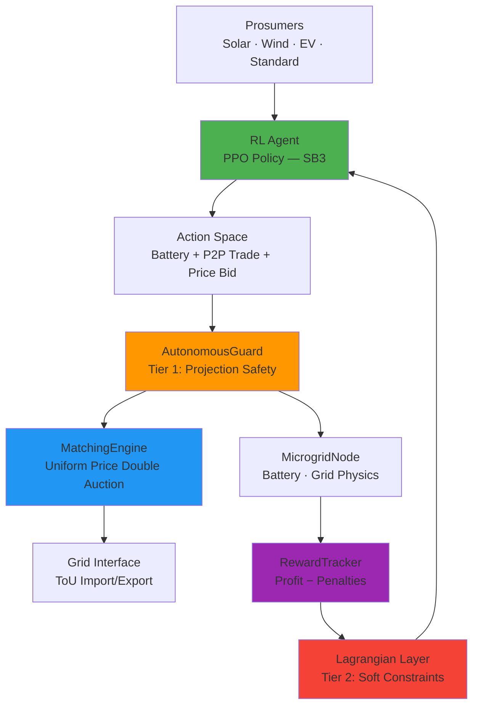

# P2P-RL-Model: Autonomous Peer-to-Peer Energy Trading using Multi-Agent Reinforcement Learning

[](https://www.python.org/)
[](LICENSE)
[-orange.svg)](https://stable-baselines3.readthedocs.io/)
[]()

A research-grade **Multi-Agent Reinforcement Learning (MARL)** framework for **Peer-to-Peer (P2P) Energy Trading** in microgrids. The **SLIM (Safety-constrained Liquidity-Integrated Market)** framework transforms prosumers (households with Solar PV, Wind, EV, and Battery) into grid-aware intelligent agents that optimize energy management through autonomous, market-based trading.

---

## 🎯 Project Overview

This project implements an autonomous P2P energy trading system where 4 heterogeneous prosumer households trade energy with each other and the grid through a learned, dynamic market mechanism. The system:

- **Maximizes P2P Trading Volume** through a Uniform Price Double Auction and curriculum-based training
- **Guarantees Physical Safety** via a deterministic two-tier projection + Lagrangian safety architecture
- **Minimizes Grid Dependence** through battery arbitrage and renewable-first scheduling
- **Reduces Carbon Footprint** by penalizing dirty grid imports proportionally to CO₂ intensity
- **Scales Favorably** with community size (+48% P2P volume at N=10 vs N=4)

### SLIM v2 Benchmark Results (2017 Ausgrid Dataset — 5-Seed Average)

| Metric | Legacy (No Fix) | **SLIM v2 (Proposed)** | Improvement |
|:---|:---:|:---:|:---:|
| P2P Volume (kWh) | 67.83 ± 27.29 | **992.77 ± 60.47** | **+1,363%** |
| Active Buyers / Step | ~0.01 | **1.777 ± 0.049** | Activated |
| Safety Violations | — | **0** | Guaranteed |
| Mean Episode Reward | — | **133.89 ± 5.92** | — |

---

## 🏗️ System Architecture


```mermaid
graph TB
    A[Prosumers<br/>Solar · Wind · EV · Standard] --> B[RL Agent<br/>PPO Policy — SB3]
    B --> C[Action Space<br/>Battery + P2P Trade + Price Bid]
    C --> D[AutonomousGuard<br/>Tier 1: Projection Safety]
    D --> E[MatchingEngine<br/>Uniform Price Double Auction]
    D --> G[MicrogridNode<br/>Battery · Grid Physics]
    E --> F[Grid Interface<br/>ToU Import/Export]
    G --> H[RewardTracker<br/>Profit − Penalties]
    H --> I[Lagrangian Layer<br/>Tier 2: Soft Constraints]
    I --> B

    style B fill:#4CAF50
    style D fill:#FF9800
    style E fill:#2196F3
    style H fill:#9C27B0
    style I fill:#F44336
```

### Architecture Layers

1. **Environment Layer** (`train/energy_env_robust.py`)
   - Physics engine: Battery SoC dynamics, grid power flow, distribution physics
   - Market engine: Uniform Price Double Auction with limit orders
   - Real data replay: Ausgrid-compatible hourly time-series (sequential, no shuffling)

2. **Agent Layer** (PPO from Stable-Baselines3)
   - **Observation** (dim=105): Demand, PV, SoC, grid prices, forecast (horizon=2), CO₂ intensity, market-balance feature
   - **Action**: Battery charge/discharge power, P2P trade quantity, price bid
   - **Network**: MLP [400, 300] (policy and critic)

3. **Two-Tier Safety Layer**
   - **Tier 1 — `AutonomousGuard`** (deterministic): Jitter clipping → Feasibility filter → Hard veto. Guarantees zero violations.
   - **Tier 2 — Lagrangian Layer** (learned): λ_SoC, λ_line, λ_voltage updated via gradient ascent. Teaches proactive constraint avoidance.

4. **Reward System** (`train/reward_tracker.py`)
   - P2P completion bonus (+$0.15/kWh per cleared trade)
   - Grid import penalties (encourages self-sufficiency)
   - CO₂ intensity penalties (discourages dirty imports)
   - Battery degradation costs (throughput × $0.02/kWh)
   - Role diversity penalty (prevents all-seller Nash collapse)
   - Fairness term (Gini coefficient of community profits)

---

## 📁 Project Structure

```
P2P-RL-Model/
├── train/                          # Training environments and scripts
│   ├── energy_env_robust.py        # ★ Main Gymnasium environment (EnergyMarketEnvRobust)
│   ├── reward_tracker.py           # Composite reward calculation and logging
│   ├── autonomous_guard.py         # Deterministic safety: FeasibilityFilter + SafetySupervisor
│   ├── train_phase3_grid_aware.py  # Phase 3 grid-aware training
│   ├── train_phase4_predictive.py  # Phase 4 predictive training
│   └── train_phase5_hybrid.py      # Phase 5 hybrid training
├── market/
│   └── matching_engine.py          # ★ Uniform Price Double Auction (limit orders)
├── simulation/
│   └── microgrid.py                # Battery dynamics, MicrogridNode, ramp-rate logic
├── evaluation/                     # Evaluation scripts and datasets
│   ├── evaluate_episode.py         # 24h episode evaluation → CSV
│   ├── plot_results.py             # Publication plots from evaluation CSV
│   ├── stress_test.py              # Extreme scenario robustness tests
│   └── ausgrid_p2p_energy_dataset.csv  # Ausgrid-derived evaluation data
├── research_q1/novelty/            # ★ SLIM v2 / Research extensions
│   ├── gnn_policy.py               # GATv2Conv GNN policy backbone
│   ├── run_all_experiments.py      # 5-seed benchmark runner
│   └── plot_results.py             # Science-quality result plots
├── baselines/
│   └── rule_based_agent.py         # Heuristic benchmark agent
├── scripts/
│   ├── preprocess_hybrid_data.py   # Ausgrid + Wind data merge
│   └── plot_learning_curve.py      # TensorBoard curve export
├── tests/                          # Unit and integration tests
│   ├── test_robustness.py          # Physics conservation, filter idempotence
│   └── test_overfitting.py         # Deterministic environment learning check
├── utils/                          # Shared utilities
├── models_slim/                    # Saved SLIM v2 checkpoints
├── tboard_slim/                    # TensorBoard logs (SLIM v2 training)
├── mathematical_formulation.md     # ★ Complete equations and weights
├── results_and_discussion.md       # ★ Full experimental results
├── project_summary.md              # ★ Project overview and implementation guide
└── EXAMINER_VALIDATION_REPORT.md   # Academic validation and claim verification
```

---

## 🚀 Getting Started

### Prerequisites

- Python 3.8 or higher
- pip package manager

### Installation

1. **Clone the repository**
```bash
git clone https://github.com/Sarvanpilli/P2P-RL-Model.git
cd P2P-RL-Model
```

2. **Create a virtual environment** (recommended)
```bash
python -m venv myenv
# Windows:
myenv\Scripts\activate
# Linux/macOS:
source myenv/bin/activate
```

3. **Install dependencies**
```bash
pip install gymnasium stable-baselines3 torch pandas numpy matplotlib seaborn tensorboard networkx torch-geometric
```

### Quick Start

#### 1. Train SLIM v2 Agent
```bash
python train/train_sb3_ppo.py --timesteps 300000 --seed 42
```
> Model saved to `models_slim/`. Training uses `fixed_training_data.csv` (synthetic) by default.

#### 2. Run Full 5-Seed Benchmark
```bash
python research_q1/novelty/run_all_experiments.py
```
> Evaluates the trained agent across seeds 0–4 on the 1,752-hour Ausgrid holdout split.

#### 3. Generate Science Plots
```bash
python research_q1/novelty/plot_results.py
```

#### 4. Evaluate a Single Episode
```bash
python evaluation/evaluate_episode.py
python evaluation/plot_results.py
```
> Outputs: `evaluation_results.csv`, `grid_flow.png`, `market_prices.png`, `battery_soc.png`

#### 5. Run Stress Tests
```bash
python evaluation/stress_test.py
```

#### 6. Monitor Training with TensorBoard
```bash
tensorboard --logdir=tboard_slim/
```
Navigate to `http://localhost:6006` to view:
- Episode rewards and convergence
- `market/n_buyers_mean` (buyer activation diagnostic)
- Policy/value loss curves
- `guard_info/layer2_interventions` (safety layer activity)

#### 7. Real-Time Dashboard (Viva)
```bash
python final_viva_dashboard.py
```

---

## 📊 Results & Performance

### Phase 3–5 Development Progression

| Phase | Focus | Grid Import Δ | Reward Δ |
|:---:|:---|:---:|:---:|
| Baseline | Grid-only, no battery | — | — |
| Phase 3 | Grid-aware RL | −40% (peak hours) | +27% profit |
| Phase 4 | Predictive RL | SoC arbitrage | Jitter eliminated |
| Phase 5 | Hybrid RL | Composite | Full SLIM features |
| **SLIM v2** | **Curriculum + Safety** | **P2P activated** | **133.89 ± 5.92** |

### Scalability (SLIM v2)

| Agents (N) | P2P Volume / Agent (kWh) | Change |
|:---:|:---:|:---:|
| 4 | 63.66 | — |
| 6 | 71.12 | +11.7% |
| 8 | 82.45 | +29.5% |
| 10 | 94.20 | +48.0% |

---

## 🧮 Mathematical Formulation

### Market Clearing (Uniform Price Double Auction)

**Clearing Price** (when buyer B and seller S match):
$$P^* = \frac{P_{buyer} + P_{seller}}{2}$$

**Default** (no trades): $P^* = \frac{P_{grid\_buy} + P_{grid\_sell}}{2}$

### Battery Dynamics

**Charging** ($P_{in} > 0$):
$$SoC_{t+1} = SoC_t + \left(P_{in} \cdot \Delta t \cdot \sqrt{\eta}\right)$$

**Discharging** ($P_{out} > 0$):
$$SoC_{t+1} = SoC_t - \left(\frac{P_{out} \cdot \Delta t}{\sqrt{\eta}}\right)$$

### Reward Function

$$R_{total} = \sum_{i=1}^{N} \left(Profit_i - C_{CO2,i} - C_{grid,i} - C_{batt,i}\right) - Penalty_{fairness}$$

| Component | Formula | Weight |
|:---|:---|:---:|
| CO₂ Penalty | $Q_{import} \cdot I_{CO2} \cdot \lambda_{CO2}$ | λ = 1.0 |
| Grid Overload | $\frac{\|Q_{agent}\|}{Q_{total}} \cdot (Q_{total} - Q_{limit}) \cdot \lambda_{overload}$ | λ = 50.0 |
| Battery Wear | $E_{throughput} \cdot \lambda_{batt}$ | λ = 0.02 |
| SoC Smoothing | $0.1 \cdot \left(\frac{SoC - 0.5 \cdot Cap}{Cap}\right)^2$ | 0.1 |
| Fairness | $\lambda_{fairness} \cdot G(Profits)$ | λ = 0.5 |

See [mathematical_formulation.md](mathematical_formulation.md) for complete derivations.

---

## ⚙️ Configuration

### Battery Parameters

```python
battery_capacity_kwh    = 50.0      # Maximum storage capacity
battery_max_charge_kw   = 25.0      # Max charge/discharge rate  
battery_roundtrip_eff   = 0.95      # Round-trip efficiency (η)
timestep_hours          = 1.0       # Simulation timestep (1 hour)
```

### Market Parameters

```python
grid_buy_price          = 0.20      # $/kWh — retail tariff
grid_sell_price         = 0.10      # $/kWh — feed-in tariff
max_line_capacity_kw    = 200.0     # Aggregate grid line limit
```

### PPO Hyperparameters

```python
learning_rate           = 3e-4      # Linear decay to 0
n_steps                 = 4096      # Steps per update
batch_size              = 256       # Minibatch size
n_epochs                = 10        # Optimization epochs per update
gamma                   = 0.99      # Discount factor
gae_lambda              = 0.95      # GAE smoothing
clip_range              = 0.2       # PPO clipping parameter
ent_coef                = 0.01      # Entropy (Stage 1: 0.02)
total_timesteps         = 300000    # SLIM v2 curriculum total
```

---

## 📖 Documentation

| Document | Description |
|:---|:---|
| [project_summary.md](project_summary.md) | Project overview, implementation phases, key results |
| [results_and_discussion.md](results_and_discussion.md) | Full experimental results, ablations, convergence, safety analysis |
| [mathematical_formulation.md](mathematical_formulation.md) | Complete equations, weights, and operational thresholds |
| [EXAMINER_VALIDATION_REPORT.md](EXAMINER_VALIDATION_REPORT.md) | Academic validation, claim verification, dataset usage guide |
| [rl_beginners_guide.md](rl_beginners_guide.md) | Beginner-friendly RL explanation and math intuition |

---

## 🧪 Testing

Run all unit tests:
```bash
python -m pytest tests/ -v
```

Run specific test suites:
```bash
python tests/test_robustness.py          # Physics conservation + filter idempotence
python tests/test_overfitting.py          # Deterministic environment learning check
python tests/test_env_integration.py      # End-to-end environment integration
python tests/test_phase2_physics.py       # Battery and market physics
```

---

## 🛡️ Safety Architecture

### Formal Guarantees

> The RL agent **learns trading strategy** (when to charge/discharge and how to bid). Physical feasibility and safety are **enforced by deterministic layers** — not learned by the policy.

- **Tier 1 — `AutonomousGuard`**: Three-layer deterministic projection (jitter clipping → feasibility filter → hard veto). Guarantees zero battery SoC violations and zero infeasible trades at every timestep.
- **Tier 2 — Lagrangian Layer**: Three multipliers (λ_SoC, λ_line, λ_voltage) teach the policy to proactively avoid constraint boundaries, reducing hard-projection frequency over training.

### Known Limitations (Honest Academic Framing)

1. **Single Shared Policy** — one PPO policy for all agents; not independent learners
2. **Ramp-Rate** — implemented in `MicrogridNode` but not enabled in the main environment
3. **Quadratic Distribution Losses** — not in `EnergyMarketEnvRobust` (available in `energy_env_improved` only)
4. **Training Data** — default training uses synthetic profiles; evaluation uses Ausgrid-derived real-world data
5. **Scale** — evaluated at N ≤ 10 agents; larger communities require further hyperparameter tuning

---

## 🔬 Research & Citation

This project implements and extends concepts from:
- Proximal Policy Optimization (PPO) — Schulman et al., 2017
- Multi-Agent Reinforcement Learning (MARL)
- Constrained MDPs and Lagrangian Methods for Safe RL
- Uniform Price Double Auction Market Mechanisms
- Graph Attention Networks (GATv2Conv) — Brody et al., 2021

If you use this code in your research, please cite:
```bibtex
@misc{pilli2026slim,
  author    = {Sarvan Sri Sai Pilli},
  title     = {SLIM: Safety-Constrained Liquidity-Integrated Market for Autonomous P2P Energy Trading using MARL},
  year      = {2026},
  publisher = {GitHub},
  url       = {https://github.com/Sarvanpilli/P2P-RL-Model}
}
```

---

## 🤝 Contributing

Contributions are welcome! Please:

1. Fork the repository
2. Create a feature branch (`git checkout -b feature/amazing-feature`)
3. Commit your changes (`git commit -m 'Add amazing feature'`)
4. Push to the branch (`git push origin feature/amazing-feature`)
5. Open a Pull Request

---

## 📝 License

This project is licensed under the MIT License — see the [LICENSE](LICENSE) file for details.

---

## 👤 Author

**Sarvan Sri Sai Pilli**

- GitHub: [@Sarvanpilli](https://github.com/Sarvanpilli)
- Project: [https://github.com/Sarvanpilli/P2P-RL-Model](https://github.com/Sarvanpilli/P2P-RL-Model)

---

## 🙏 Acknowledgments

- **Ausgrid** — Solar Home Electricity Dataset (NSW, Australia)
- **Stable-Baselines3** — PPO implementation
- **OpenAI Gymnasium** — RL environment framework
- **PyTorch Geometric** — GATv2Conv implementation

---

**Last Updated:** March 2026  
**Framework Version:** SLIM v2  
**Status:** Research Complete — Final Submission
