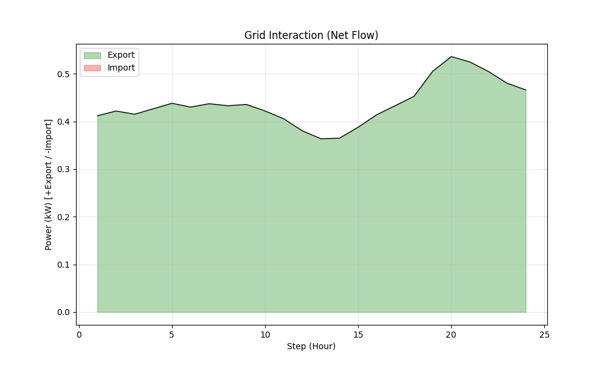
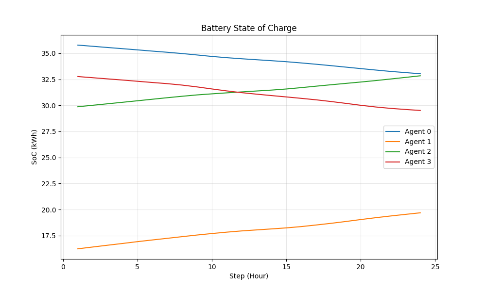
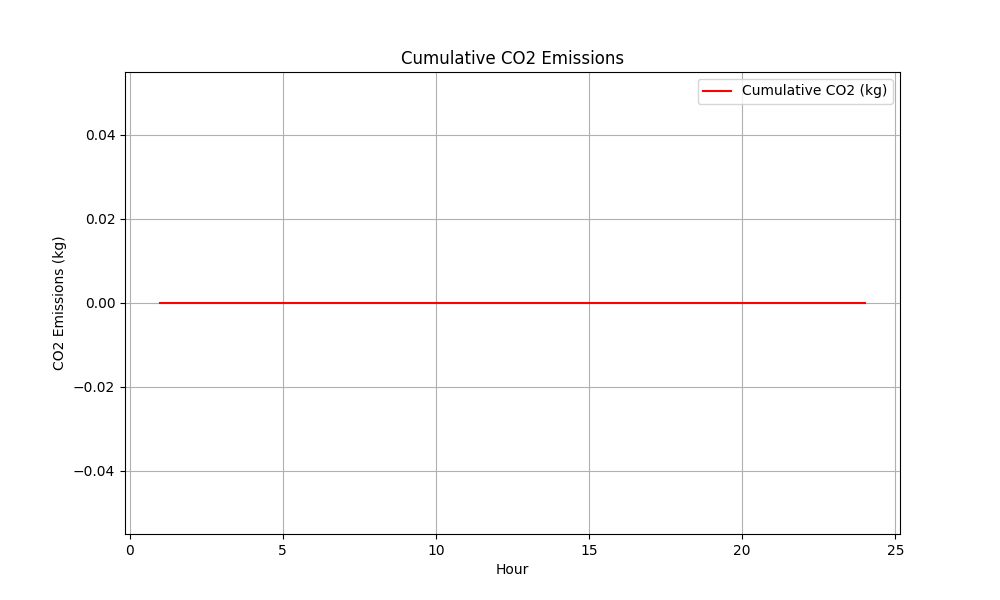

# Walkthrough: P2P-RL-Model Final Upgrade

We have successfully upgraded the P2P Energy Trading model to meet all advanced requirements, including **Dynamic Price Bidding**.

## 1. Key Features Implemented

### A. Environment & State
*   **CO2 Tracking**: The environment now tracks grid CO2 intensity (g/kWh) and penalizes high-carbon imports.
*   **Forecast Uncertainty**: Observations now include standard deviation for forecasts, simulating real-world uncertainty.
*   **Line Flows**: Grid export/import flows are explicitly observed.

### B. Safety Layer
*   **FeasibilityFilter**: A new module (`train/safety_filter.py`) strictly enforces physics:
    *   Prevents simultaneous charge/discharge.
    *   Clamps actions to respect SoC limits (0-100%).
    *   Ensures battery power limits are never exceeded.

### C. Advanced Matching Engine (Limit Orders)
*   **Dynamic Pricing**: The RL agent now sets a **Price Bid** ($/kWh) for every trade, in addition to the quantity.
*   **Limit Order Book**: The `MatchingEngine` (`market/matching_engine.py`) matches orders based on price priority:
    *   **Sellers**: Sorted by Ask Price (Low to High).
    *   **Buyers**: Sorted by Bid Price (High to Low).
    *   **Clearing**: Trades occur where Buyer Bid >= Seller Ask.
*   **Grid Backing**: Unmatched orders clear against the Grid at Retail/Feed-in rates if price limits allow.

## 2. Verification Results

We trained the model for 50,000 steps and ran a full 24-hour evaluation on synthetic data.

### Market Dynamics
The market price now responds to net imbalance and agent bidding strategies.

### Grid Interaction
The system manages exports and imports to balance the microgrid.

### Battery Management
Agents manage their State of Charge (SoC) to arbitrage prices and store solar energy.

### CO2 Impact
Cumulative CO2 emissions are tracked and minimized where possible.

## 3. How to Run

1.  **Train**: `python train/train_sb3_ppo.py`
2.  **Generate Data**: `python generate_data.py`
3.  **Evaluate**: `python evaluation/evaluate_episode.py`
4.  **Plot**: `python evaluation/plot_results.py`
